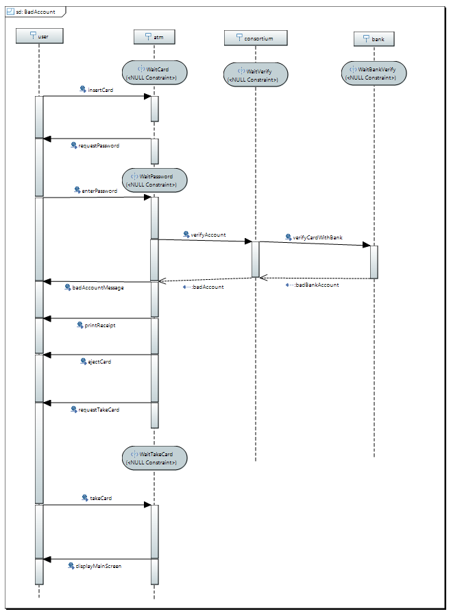

# MDA - Model Driven Architecture

This repository implements an UML model transformation from UML sequence charts to UML state machines. The implementation is based on the paper *Activity-Driven Synthesis of State Machines* from Rolf Hennicker and Alexander Knapp.

## Input language UML 2.0 interactions
* “lingua franca” of software engineering
* only “simple” interactions (no interaction operators, like strict, alt, &c.)
* rendered in a tabular notation

##1. Projection of scenarios on each object

##2. Grouping of projections into behaviours
 * capturing reaction of an object to a (synchronous) message
 * Idea: object waits for (synchronous) message in a stable state, performs reaction as its activity

##3. Integration of behaviours across scenarios into I/O-automaton
 * Non-determinism as indicator of inconsistency and incompleteness

### Output language UML 2.0 state machines
 * Separation between “stable” and “activity” states

### Participants
 * Patrick D'Addona
 * Ida Buchwald
 * Michael Haubenschild
 * Daniel Langerenken
 * Maximilian Osenberg
 * Johannes Stanggassinger
